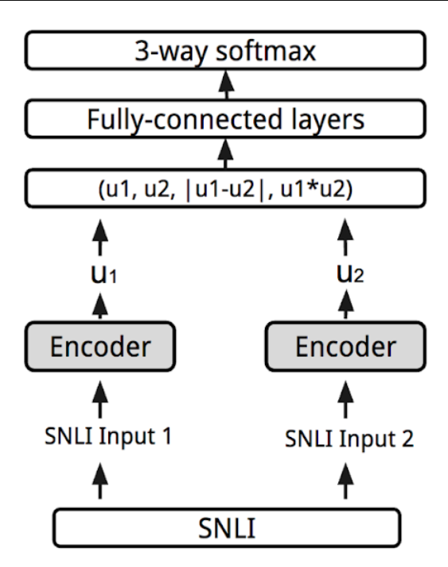

# Measuring Semantic Textual Similarity

A siamese network to measure semantic textual similarity.

# Table of contents
* [Team Members](#team-members)
* [Setup](#setup)
* [Technologies](#technologies)
* [Description](#description)
  * [Data Preparation](#data-preparation)
  * [Embedding](#embedding)
  * [Deep Model](#deep-model)
  * [Training](#training)
* [Results](#results)

# Team Members:
- Farbod Nazari Montazer (960122681008)

# Setup:
To run this project on your own device you need to install python, something to run the jupyter notebook (I used vs code) and the following dependencies.

```bash
pip install torch
pip install pandas
pip install numpy
```
Alternatively you could just run it on gooogle colab or other web based Jupyter notebook IDEs.

# Technologies:
- Python 3
- Jupyer notebook
- Pytorch

# Description:

## Data Preparation:
I used 20000 sentence pairs from snli [link.](https://nlp.stanford.edu/projects/snli/)  
### steps:
1. Broke them into train, validation and test sets. 
2. Turned the labels into 0 1 and 2, 0 showing contradiction 1 showing neutrality and 2 showing entailment.  
### Examples:
| Sentence 1 | Sentence 2 | Label |
| --- | --- | --- |
| Two dogs play | Two cats are playing | 0 |
| The skier is doing a flip through some trees | The skier is winning a competition | 1 |
| A young boy giving his brother a piggyback ride | a boy is giving his brother a ride | 2 |  

## Embedding:
I used torch's embedding in freeze mode since it didn't seem to work well with a small dataset otherwise and it was very slow, besides.  
### Steps:
1. Made a vocabulary out of every unqiue word.
2. Initialized them into a dictionary with 300 tensors for each word.
3. Put the tensors into an embedding in the same order as vocabulary which I used for lookups.

## Deep model:
To calculate semantic simularity between two sentences the more common practice seems to be using siamese networks.  

### Model:
<p align="center">
  
  <h6 align="center">
   picture from google's ai blog.
   <a href="https://ai.googleblog.com/2018/05/advances-in-semantic-textual-similarity.html">
   (link)
   </a>
  <h6>
</p>

### How it works:
1. The main idea is that we take each sentence and feed it to an LSTM word by word to get a tensor representation of the sentence.
2. Then generate a features tensor from combining the two sentences (u1, u2, |u1-u2|, u1*u2).
3. Pass it through a sequential neural network.
4. And use soft max at the end to get our output from the cross entropy loss.

## Training:
For loss I used Cross Entropy Loss which is used to compute loss based on negative log likelihood.

Trained the network for 7 epochs with Adam optimizer to 1.0123202 loss for our test set.

I did get better results with Mse optimizer but it would take many more epochs to reach comparable numbers.  

# Results:


## Examples:
| Sentence 1 | Sentence 2 | Label | Prediction
| --- | --- | --- | --- |
| Two dogs play | Two cats are playing | 0 | 1.6192814111709595 |
| The skier is doing a flip through some trees | The skier is winning a competition | 1 | 0.8854045867919922 |
| A young boy giving his brother a piggyback ride | a boy is giving his brother a ride | 2 |  1.5023632049560547 |

Some predictions are pretty close while others are simply wrong for example as you can see in sentences that are similar but have slight differences like dogs and cats our predictions get very wrong.

In the end our network with a test loss of about 1, seems ok comparatively to other projects with the same size of dataset and epoch numbers, but probably more fine tunings can be done.

Alright, that's it.  
Cheers.